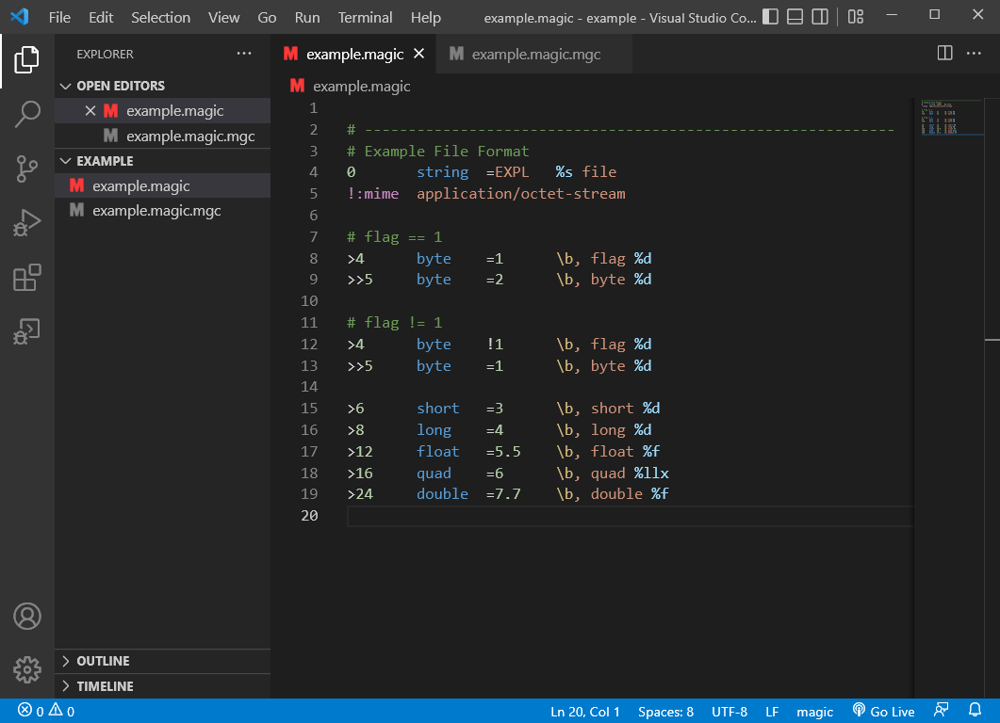

vscode-magic
===

file command's magic pattern file support for vscode.

* File icon
* Syntax highlighting

## File icon

icon | extension | file type
--- | --- | ---
 | `*.magic` | ASCII text file
 | `*.mgc` | binary file

## Syntax highlighting

